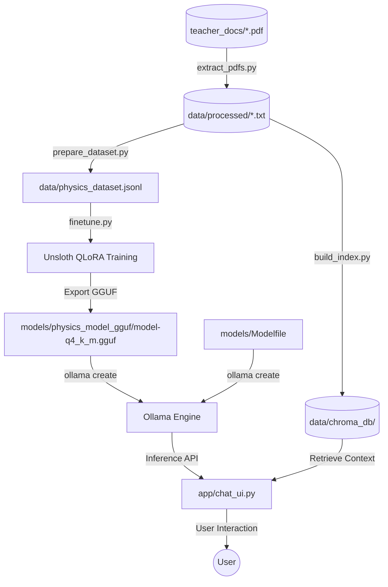

# Physics Teacher SLM Design

**Spec**: `.specs/features/physics-teacher-slm/spec.md`
**Status**: Draft

---

## Architecture Overview

O projeto adota uma arquitetura híbrida que combina **RAG (Retrieval-Augmented Generation)** para factualidade e **QLoRA Fine-tuning** para estilo, rodando inteiramente em ambiente local (RTX 3050, 4GB VRAM).



---

## Code Reuse Analysis

### Existing Components to Leverage

| Component | Location | How to Use |
| --- | --- | --- |
| `scripts/extract_pdfs.py` | `scripts/extract_pdfs.py` | Executado para converter slides/documentos do professor para texto legível. |
| `training/prepare_dataset.py` | `training/prepare_dataset.py` | Executado para automatizar a geração de prompts instrução-resposta usando Ollama. |
| `rag/build_index.py` | `rag/build_index.py` | Executado para tokenizar o texto extraído e popular o ChromaDB. |
| `rag/query_engine.py` | `rag/query_engine.py` | Executado para testar buscas semânticas locais e integração de contexto. |
| `training/finetune.py` | `training/finetune.py` | Script que encapsula a otimização de bitsandbytes + Unsloth para a GPU de 4GB VRAM. |
| `models/Modelfile` | `models/Modelfile` | Usado pelo Ollama para empacotar o GGUF com as diretrizes de sistema. |
| `app/chat_ui.py` | `app/chat_ui.py` | Interface web Gradio para testes side-by-side e interação final. |

---

## Components

### 1. Environment Setup Setup (`setup_env.sh`)
- **Purpose**: Instalar bibliotecas de sistema, pyenv, Python 3.12, virtual environment, PyTorch com CUDA 12.1, dependências Python e Ollama com os modelos base.
- **Location**: `scripts/setup_env.sh`
- **Interfaces**: CLI execution: `bash scripts/setup_env.sh`
- **Dependencies**: pyenv, internet connection, sudo access (for system build-deps and Ollama script).

### 2. PDF Extractor (`extract_pdfs.py`)
- **Purpose**: Extrair texto de PDFs de forma estruturada.
- **Location**: `scripts/extract_pdfs.py`
- **Interfaces**: `extract_text_from_pdf(pdf_path: Path): str`
- **Dependencies**: PyMuPDF (`fitz`), raw PDFs placed in `teacher_docs/` or `data/raw/`.

### 3. Dataset Generator (`prepare_dataset.py`)
- **Purpose**: Gerar o dataset de ajuste de estilo contendo 200 a 400 exemplos.
- **Location**: `training/prepare_dataset.py`
- **Interfaces**: `generate_qa_pairs(text: str, num_pairs: int): List[dict]`
- **Dependencies**: Ollama rodando localmente, modelo `qwen2.5:3b`.

### 4. RAG Indexer (`build_index.py`)
- **Purpose**: Construir o armazenamento vetorial de documentos do professor.
- **Location**: `rag/build_index.py`
- **Interfaces**: CLI execution: `python rag/build_index.py`
- **Dependencies**: ChromaDB, LlamaIndex, Ollama rodando localmente com `nomic-embed-text`.

### 5. QLoRA Trainer (`finetune.py`)
- **Purpose**: Fine-tuning otimizado do Qwen 2.5 3B para adaptação de estilo de linguagem.
- **Location**: `training/finetune.py`
- **Interfaces**: CLI execution: `python training/finetune.py --epochs 3`
- **Dependencies**: Unsloth, PyTorch com CUDA, RTX 3050 GPU, `data/physics_dataset.jsonl`.

### 6. Gradio UI Server (`chat_ui.py`)
- **Purpose**: Servir a interface web para interagir com os modelos base e customizados lado a lado.
- **Location**: `app/chat_ui.py`
- **Interfaces**: Gradio Web Server (`http://localhost:7860`)
- **Dependencies**: Gradio, Ollama (com `qwen2.5:3b` e `physics-teacher`), ChromaDB.

---

## Data Models

### Training Dataset Entry (ShareGPT / ChatML format)
```json
{
  "conversations": [
    {
      "role": "system",
      "content": "Você é o professor de física. Explique ou resolva o problema usando seu estilo e notação."
    },
    {
      "role": "user",
      "content": "Como funciona o empuxo?"
    },
    {
      "role": "assistant",
      "content": "Olha só, o empuxo é a força que o fluido exerce sobre um corpo submerso... Conforme a notação, E = rho * V * g."
    }
  ]
}
```

---

## Error Handling Strategy

| Error Scenario | Handling | User Impact |
| --- | --- | --- |
| Sudo Timeout (Fase 0) | O script detecta falha ao rodar apt-get e instrui o usuário a rodar com privilégios adequados ou interativamente. | O usuário é alertado explicitamente no console sobre o bloqueio de permissão. |
| CUDA OOM (Fase 3) | O script de treino limita o sequence length a 1024, batch size = 1, e ativa expandable_segments na VRAM. | O treinamento avança lentamente sem estourar a VRAM. |
| ChromaDB Vazio (Fase 2/5) | Se o banco vetorial não encontrar documentos, o RAG falha silenciosamente no log e usa apenas o conhecimento interno. | O usuário recebe resposta normal do modelo com um aviso sobre fontes indisponíveis. |

---

## Risks & Concerns

| Concern | Location | Impact | Mitigation |
| --- | --- | --- | --- |
| Limitação de VRAM (4GB) | `training/finetune.py` | CUDA OOM durante o fine-tuning. | Utilizar Unsloth 4-bit, batch size = 1, gradient accumulation = 4 e sequence length = 1024. |
| Dependência de Sudo | `scripts/setup_env.sh` | Falha na automação se rodar sem sudo ou com timeout no WSL. | Executar comandos que requerem sudo separadamente se necessário, ou instruir o usuário para autenticar no terminal antes. |
| Ausência de PDFs | `teacher_docs/` | Falha ao gerar dataset e RAG. | O script de extração valida se há arquivos `.pdf` e fornece instrução clara. |

---

## Tech Decisions

| Decision | Choice | Rationale |
| --- | --- | --- |
| Modelo Base | Qwen 2.5 3B Instruct | Ideal para inferência local em GPU de 4GB VRAM com excelente capacidade instruct. |
| Otimização | Unsloth | Reduz em até 60% o uso de VRAM no fine-tuning de LLMs frente ao HuggingFace Trainer padrão. |
| Vetorizador | ChromaDB + nomic-embed-text | Solução robusta e leve de vector store local compatível com LlamaIndex. |
