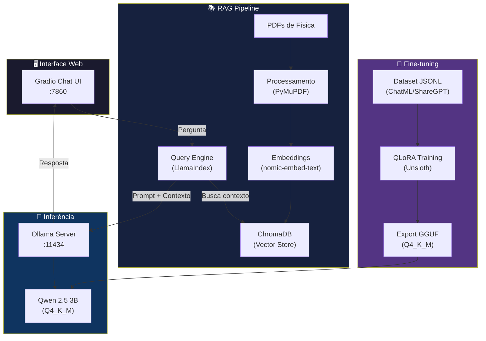

# 🧲 Professor de Física IA — Physics Teacher SLM

> Assistente inteligente de Física baseado em SLM (Small Language Model) com RAG, fine-tuning local via QLoRA, e interface web — 100% local e privado.

[](https://python.org)
[](https://huggingface.co/Qwen)
[](LICENSE)

---

## 📋 Sobre o Projeto

O **Professor de Física IA** é um sistema completo que combina:

- **Fine-tuning local** de um SLM (Qwen 2.5 3B) com QLoRA via Unsloth, treinado em materiais didáticos de Física
- **RAG (Retrieval-Augmented Generation)** com LlamaIndex + ChromaDB para respostas contextualizadas
- **Interface web moderna** com Gradio para interação natural em Português

O objetivo é criar um assistente capaz de:
- 📖 Explicar conceitos de Física de forma didática
- 📝 Gerar questões de prova no formato do Ensino Médio e Superior brasileiro
- 🔬 Resolver problemas passo a passo
- 📚 Responder com base em materiais de referência (livros, apostilas)

---

## 🏗️ Arquitetura



---

## 💻 Pré-requisitos

### Hardware
| Componente | Mínimo | Recomendado |
|-----------|--------|-------------|
| GPU | NVIDIA com 4GB VRAM | RTX 3050+ |
| RAM | 8GB | 16GB |
| Disco | 10GB livres | 20GB |

### Software
- **SO:** Ubuntu (WSL2 no Windows) ou Linux nativo
- **Python:** 3.12 (via pyenv)
- **CUDA:** 12.1+
- **Ollama:** Última versão

---

## 🚀 Quick Start

### 1. Clone o repositório

```bash
git clone https://github.com/seu-usuario/physics-teacher-slm.git
cd physics-teacher-slm
```

### 2. Execute o setup automático

```bash
bash scripts/setup_env.sh
```

Este script instala automaticamente:
- pyenv + Python 3.12
- Virtual environment com todas as dependências
- PyTorch com CUDA 12.1
- Ollama + modelos base (Qwen 2.5 3B + nomic-embed-text)

### 3. Ative o ambiente e inicie

```bash
source .venv/bin/activate
ollama serve &              # Inicia o Ollama (se não estiver rodando)
python -m app.chat_ui       # Abre a interface web em http://localhost:7860
```

---

## 📁 Estrutura do Projeto

```
physics-teacher-slm/
├── app/
│   ├── __init__.py
│   └── chat_ui.py              # Interface web Gradio
├── data/
│   ├── raw/                    # PDFs e materiais originais
│   ├── processed/              # Dados processados
│   └── chroma_db/              # Banco vetorial ChromaDB
├── models/
│   ├── Modelfile               # Ollama Modelfile
│   └── physics_model_gguf/     # Modelo GGUF exportado
├── rag/
│   ├── __init__.py
│   ├── ingest.py               # Pipeline de ingestão de documentos
│   └── query_engine.py         # Motor de consulta RAG
├── scripts/
│   ├── __init__.py
│   ├── setup_env.sh            # Setup automático do ambiente
│   ├── prepare_dataset.py      # Preparação do dataset de treino
│   └── train_qlora.py          # Script de fine-tuning QLoRA
├── notebooks/                  # Jupyter notebooks para experimentação
├── logs/                       # Logs de treinamento e execução
├── requirements.txt            # Dependências Python
├── README.md                   # Este arquivo
└── .gitignore
```

---

## 📖 Uso Detalhado

### 🤖 Interface de Chat

```bash
python -m app.chat_ui
```

Acesse `http://localhost:7860` no navegador. A interface oferece:

- **Chat com RAG:** Respostas baseadas nos seus materiais de Física
- **Configurações:** Ajuste modelo, temperatura e top_k em tempo real
- **Exemplos prontos:** Perguntas pré-definidas para testar

### 📚 Pipeline RAG

#### Ingestão de documentos

```bash
# Coloque seus PDFs de Física em data/raw/
python -m rag.ingest
```

#### Consulta via código

```python
from rag.query_engine import get_query_engine

engine = get_query_engine()
response = engine.query("Explique a Segunda Lei de Newton")
print(response)
```

### 🎯 Fine-tuning com QLoRA

#### Preparar dataset

```bash
# O dataset deve estar em formato ChatML/ShareGPT JSONL
python scripts/prepare_dataset.py
```

#### Treinar o modelo

```bash
python scripts/train_qlora.py
```

**Configurações otimizadas para RTX 3050 (4GB VRAM):**
- Quantização: 4-bit (QLoRA)
- Batch size: 1
- Gradient accumulation: 16
- Max sequence length: 2048
- fp16: True

#### Exportar e registrar no Ollama

```bash
# Após o treino, o modelo GGUF é salvo em models/physics_model_gguf/
cd models/
ollama create physics-teacher -f Modelfile
ollama run physics-teacher
```

---

## ⚙️ Configuração

### Variáveis de ambiente (opcionais)

```bash
export OLLAMA_HOST="http://localhost:11434"  # URL do Ollama
export CUDA_VISIBLE_DEVICES="0"              # GPU a usar
```

### Parâmetros do modelo

Ajuste no arquivo `models/Modelfile`:

| Parâmetro | Padrão | Descrição |
|-----------|--------|-----------|
| temperature | 0.7 | Criatividade (0.0-1.5) |
| top_p | 0.9 | Nucleus sampling |
| top_k | 40 | Tokens candidatos |
| num_ctx | 2048 | Janela de contexto |

---

## 🧪 Exemplos de Uso

```
👤 Explique a Terceira Lei de Newton com exemplos do cotidiano.

🧲 A Terceira Lei de Newton, também conhecida como Lei da Ação e Reação,
   afirma que: para toda força de ação existe uma força de reação,
   de mesma intensidade e direção, mas em sentido oposto.

   Exemplos do cotidiano:
   1. Ao caminhar, seus pés empurram o chão para trás (ação)
      e o chão empurra seus pés para frente (reação)...
```

---

## 🔒 Privacidade

Todo o processamento acontece **localmente na sua máquina**:
- ✅ Nenhum dado enviado para servidores externos
- ✅ Modelo roda via Ollama local
- ✅ Embeddings gerados localmente
- ✅ Banco vetorial armazenado no disco local

---

## 🤝 Contribuindo

Contribuições são bem-vindas! Sinta-se à vontade para:

1. Fazer fork do projeto
2. Criar uma branch (`git checkout -b feature/minha-feature`)
3. Commit suas mudanças (`git commit -m 'Adiciona minha feature'`)
4. Push para a branch (`git push origin feature/minha-feature`)
5. Abrir um Pull Request

---

## 📄 Licença

Este projeto está sob a licença MIT. Veja o arquivo [LICENSE](LICENSE) para detalhes.

---

<div align="center">

**Feito com 🧲 para estudantes e professores de Física**

*Qwen 2.5 3B • Unsloth QLoRA • LlamaIndex • ChromaDB • Ollama • Gradio*

</div>
