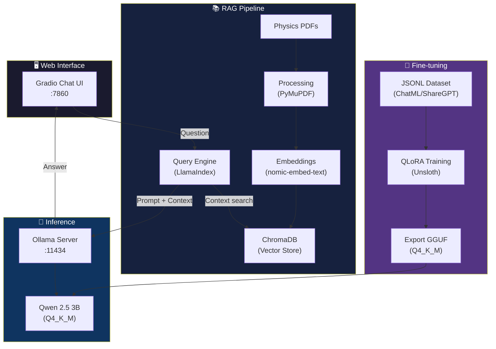

# 🧲 Physics Teacher AI — Physics Teacher SLM

> An intelligent Physics assistant based on a SLM (Small Language Model) with RAG, local fine-tuning via QLoRA, and a web interface — 100% local and private.

[](https://python.org)
[](https://huggingface.co/Qwen)
[](LICENSE)

---

## 📋 About the Project

**Physics Teacher AI** is a complete system that combines:

- **Local fine-tuning** of a SLM (Qwen 2.5 3B) with QLoRA via Unsloth, trained on Physics teaching materials
- **RAG (Retrieval-Augmented Generation)** with LlamaIndex + ChromaDB for context-aware responses
- **Modern web interface** with Gradio for natural interaction in Portuguese

The goal is to create an assistant capable of:
- 📖 Explaining Physics concepts in a didactic way
- 📝 Generating exam questions at high school and university level
- 🔬 Solving problems step by step
- 📚 Answering based on reference materials (textbooks, lecture notes)

---

## 🏗️ Architecture



---

## 💻 Prerequisites

### Hardware
| Component | Minimum | Recommended |
|-----------|---------|-------------|
| GPU | NVIDIA with 4GB VRAM | RTX 3050+ |
| RAM | 8GB | 16GB |
| Disk | 10GB free | 20GB |

### Software
- **OS:** Ubuntu (WSL2 on Windows) or native Linux
- **Python:** 3.12 (via pyenv)
- **CUDA:** 12.1+
- **Ollama:** Latest version

---

## 🚀 Quick Start

### 1. Clone the repository

```bash
git clone https://github.com/nickevangelista/physics-teacher-slm.git
cd physics-teacher-slm
```

### 2. Run the automatic setup

```bash
bash scripts/setup_env.sh
```

This script automatically installs:
- pyenv + Python 3.12
- Virtual environment with all dependencies
- PyTorch with CUDA 12.1
- Ollama + base models (Qwen 2.5 3B + nomic-embed-text)

### 3. Activate the environment and start

```bash
source .venv/bin/activate
ollama serve &              # Start Ollama (if not already running)
python -m app.chat_ui       # Open the web interface at http://localhost:7860
```

---

## 📁 Project Structure

```
physics-teacher-slm/
├── app/
│   ├── __init__.py
│   └── chat_ui.py              # Gradio web interface
├── data/
│   ├── raw/                    # Original PDFs and materials
│   ├── processed/              # Processed data
│   └── chroma_db/              # ChromaDB vector store
├── models/
│   ├── Modelfile               # Ollama Modelfile
│   └── physics_model_gguf/     # Exported GGUF model
├── rag/
│   ├── __init__.py
│   ├── ingest.py               # Document ingestion pipeline
│   └── query_engine.py         # RAG query engine
├── scripts/
│   ├── __init__.py
│   ├── setup_env.sh            # Automatic environment setup
│   ├── prepare_dataset.py      # Training dataset preparation
│   └── train_qlora.py          # QLoRA fine-tuning script
├── notebooks/                  # Jupyter notebooks for experimentation
├── logs/                       # Training and execution logs
├── requirements.txt            # Python dependencies
├── README.md                   # This file
└── .gitignore
```

---

## 📖 Detailed Usage

### 🤖 Chat Interface

```bash
python -m app.chat_ui
```

Open `http://localhost:7860` in your browser. The interface offers:

- **Chat with RAG:** Responses grounded in your Physics materials
- **Settings:** Adjust model, temperature and top_k in real time
- **Ready-made examples:** Pre-defined questions for quick testing

### 📚 RAG Pipeline

#### Document ingestion

```bash
# Place your Physics PDFs in data/raw/
python -m rag.ingest
```

#### Query via code

```python
from rag.query_engine import criar_query_engine

engine = criar_query_engine()
response = engine.query("Explain Newton's Second Law")
print(response)
```

### 🎯 Fine-tuning with QLoRA

#### Prepare the dataset

```bash
# Dataset must be in ChatML/ShareGPT JSONL format
python scripts/prepare_dataset.py
```

#### Train the model

```bash
python scripts/train_qlora.py
```

**Settings optimised for RTX 3050 (4GB VRAM):**
- Quantisation: 4-bit (QLoRA)
- Batch size: 1
- Gradient accumulation: 16
- Max sequence length: 2048
- fp16: True

#### Export and register in Ollama

```bash
# After training, the GGUF model is saved in models/physics_model_gguf/
cd models/
ollama create physics-teacher -f Modelfile
ollama run physics-teacher
```

---

## ⚙️ Configuration

### Environment variables (optional)

```bash
export OLLAMA_HOST="http://localhost:11434"  # Ollama URL
export CUDA_VISIBLE_DEVICES="0"              # GPU to use
```

### Model parameters

Adjust in `models/Modelfile`:

| Parameter | Default | Description |
|-----------|---------|-------------|
| temperature | 0.7 | Creativity (0.0–1.5) |
| top_p | 0.9 | Nucleus sampling |
| top_k | 40 | Candidate tokens |
| num_ctx | 2048 | Context window |

---

## 🧪 Usage Examples

```
👤 Explain Newton's Third Law with everyday examples.

🧲 Newton's Third Law, also known as the Law of Action and Reaction,
   states that: for every action force there is a reaction force of
   equal magnitude and direction, but opposite sense.

   Everyday examples:
   1. When walking, your feet push the ground backwards (action)
      and the ground pushes your feet forwards (reaction)...
```

---

## 🔒 Privacy

All processing happens **locally on your machine**:
- ✅ No data sent to external servers
- ✅ Model runs via local Ollama
- ✅ Embeddings generated locally
- ✅ Vector store stored on local disk

---

## 🤝 Contributing

Contributions are welcome! Feel free to:

1. Fork the project
2. Create a branch (`git checkout -b feature/my-feature`)
3. Commit your changes (`git commit -m 'Add my feature'`)
4. Push to the branch (`git push origin feature/my-feature`)
5. Open a Pull Request

---

## 📄 License

This project is under the MIT License. See the [LICENSE](LICENSE) file for details.

---

<div align="center">

**Made with 🧲 for Physics students and teachers**

*Qwen 2.5 3B • Unsloth QLoRA • LlamaIndex • ChromaDB • Ollama • Gradio*

</div>
